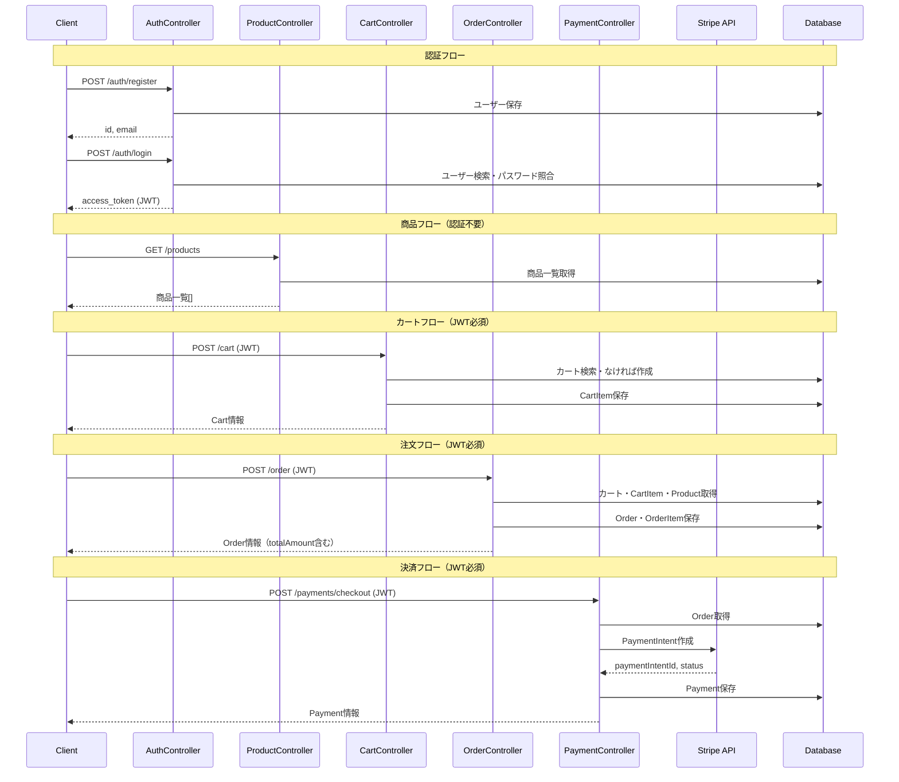

# カート機能 - バックエンド

NestJS + PostgreSQL + Stripe で構築したECサイトのバックエンドAPIです。

## デモ

フロントエンド: https://cart-front.onrender.com

## 技術スタック

- NestJS
- TypeScript
- TypeORM
- PostgreSQL
- JWT認証
- Stripe（決済）
- Render（デプロイ）

## 機能

- ユーザー登録・ログイン（JWT認証）
- 商品一覧・詳細取得
- カート追加・取得・削除
- 注文作成（合計金額自動計算）
- Stripe決済（PaymentIntent作成）

## エンドポイント

| メソッド | パス | 認証 | 説明 |
|---|---|---|---|
| POST | /auth/register | 不要 | ユーザー登録 |
| POST | /auth/login | 不要 | ログイン・JWT発行 |
| GET | /products | 不要 | 商品一覧取得 |
| GET | /products/:id | 不要 | 商品詳細取得 |
| POST | /products | 必要 | 商品作成 |
| DELETE | /products/:id | 必要 | 商品削除 |
| GET | /cart | 必要 | カート取得 |
| POST | /cart | 必要 | カートに商品追加 |
| DELETE | /cart/:id | 必要 | カート削除 |
| POST | /order | 必要 | 注文作成 |
| POST | /payments/checkout | 必要 | Stripe決済 |

## システム設計



## DBスキーマ

| テーブル | 説明 |
|---|---|
| users | ユーザー情報 |
| products | 商品情報 |
| carts | ユーザーごとのカート |
| cart_items | カートの中身（商品・数量） |
| orders | 注文情報 |
| order_items | 注文の中身（注文時価格保持） |
| payments | Stripe決済情報 |

## ローカル起動

```bash
# パッケージインストール
npm install

# PostgreSQLでDBを作成
psql postgres
CREATE DATABASE cart;
\q

# 環境変数設定
cp .env.example .env

# 起動
npm run start:dev
```

## 環境変数

| 変数名 | 説明 |
|---|---|
| DATABASE_URL | PostgreSQL接続URL（本番用） |
| JWT_SECRET | JWT署名用の秘密鍵 |
| STRIPE_SECRET_KEY | StripeのシークレットKey |
| FRONTEND_URL | CORSで許可するフロントエンドURL |
