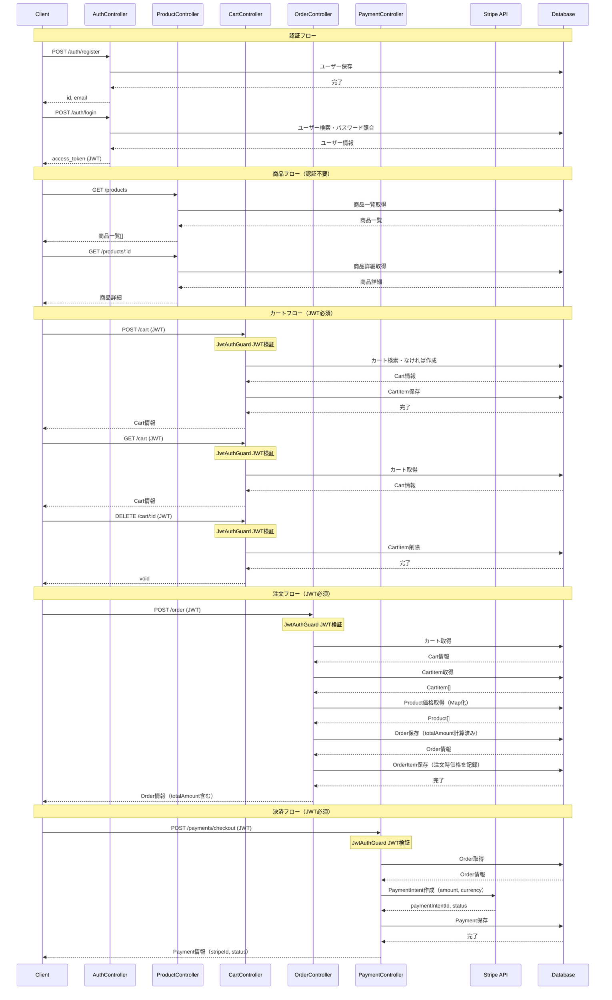

```mermaid
sequenceDiagram
  participant C as Client
  participant Auth as AuthController
  participant Product as ProductController
  participant Cart as CartController
  participant Order as OrderController
  participant Payment as PaymentController
  participant Stripe as Stripe API
  participant DB as Database

  Note over C,DB: 認証フロー

  C->>Auth: POST /auth/register
  Auth->>DB: ユーザー保存
  DB-->>Auth: 完了
  Auth-->>C: id, email

  C->>Auth: POST /auth/login
  Auth->>DB: ユーザー検索・パスワード照合
  DB-->>Auth: ユーザー情報
  Auth-->>C: access_token (JWT)

  Note over C,DB: 商品フロー（認証不要）

  C->>Product: GET /products
  Product->>DB: 商品一覧取得
  DB-->>Product: 商品一覧
  Product-->>C: 商品一覧[]

  C->>Product: GET /products/:id
  Product->>DB: 商品詳細取得
  DB-->>Product: 商品詳細
  Product-->>C: 商品詳細

  Note over C,DB: カートフロー（JWT必須）

  C->>Cart: POST /cart (JWT)
  Note over Cart: JwtAuthGuard JWT検証
  Cart->>DB: カート検索・なければ作成
  DB-->>Cart: Cart情報
  Cart->>DB: CartItem保存
  DB-->>Cart: 完了
  Cart-->>C: Cart情報

  C->>Cart: GET /cart (JWT)
  Note over Cart: JwtAuthGuard JWT検証
  Cart->>DB: カート取得
  DB-->>Cart: Cart情報
  Cart-->>C: Cart情報

  C->>Cart: DELETE /cart/:id (JWT)
  Note over Cart: JwtAuthGuard JWT検証
  Cart->>DB: CartItem削除
  DB-->>Cart: 完了
  Cart-->>C: void

  Note over C,DB: 注文フロー（JWT必須）

  C->>Order: POST /order (JWT)
  Note over Order: JwtAuthGuard JWT検証
  Order->>DB: カート取得
  DB-->>Order: Cart情報
  Order->>DB: CartItem取得
  DB-->>Order: CartItem[]
  Order->>DB: Product価格取得（Map化）
  DB-->>Order: Product[]
  Order->>DB: Order保存（totalAmount計算済み）
  DB-->>Order: Order情報
  Order->>DB: OrderItem保存（注文時価格を記録）
  DB-->>Order: 完了
  Order-->>C: Order情報（totalAmount含む）

  Note over C,DB: 決済フロー（JWT必須）

  C->>Payment: POST /payments/checkout (JWT)
  Note over Payment: JwtAuthGuard JWT検証
  Payment->>DB: Order取得
  DB-->>Payment: Order情報
  Payment->>Stripe: PaymentIntent作成（amount, currency）
  Stripe-->>Payment: paymentIntentId, status
  Payment->>DB: Payment保存
  DB-->>Payment: 完了
  Payment-->>C: Payment情報（stripeId, status）
```
